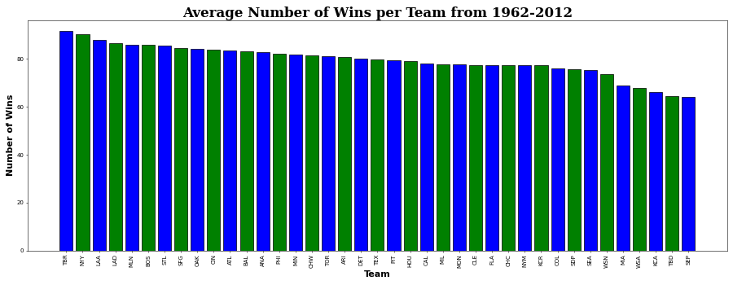
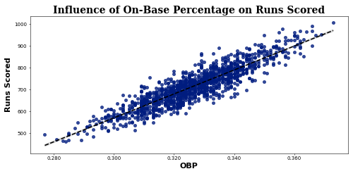
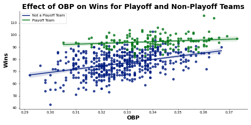

# Baseball Playoff Predictions
## Modeling MLB team playoff chances based on team statistics and attributes
**Author:** Joshua Lensing
### Business Problem:
Major League Baseball data and analytics are becoming a very big component of how professional baseball teams operate. A lot of this dataset comes from the idea of "Moneyball," where Billy Beane, the GM of the Oakland Athletics, found statisitics relating to individual player performance that scouts and other front offices were not focused on at the time. He hoped to use those background statistics and develop a formula for success that didn't require spending a large amount of money to build a roster of players. Instead, he hoped to find players that scored well in these statistical categories that other teams would often overlook and pay them cheaply to play for the Athletics. The hope was to ultimately make the playoffs and compete for a championship.

The source for this dataset can be found [here](https://www.kaggle.com/datasets/wduckett/moneyball-mlb-stats-19622012).

The data dictionary for this dataset can be found below:

| Variable Name | Descrtiption |
|---------------|--------------|
Team | Team Name
League | AL or NL
Year | Baseball Season in a Calendar Year
RS | Runs Scored
RA | Runs Allowed
W | Wins
OBP | On-Base Percentage
SLG | Slugging Percentage
BA | Batting Average
Playoffs | 0 for no playoffs, 1 for playoffs
RankSeason | Seed number during the regular season
RankPlayoff | Seend number for playoffs
G | Games Played
OOBP | Opponent On-Base Percentage
OSLG | Opponent Slugging Percentage

## Methods
- There are 2 columns I dropped from dataset before creating the visualizations: 'RankSeason' and RankPlayoff.' These columns contained a lot of missing values because they only ranked the teams in the dataset that made the playoffs. And the ranking had no use to making the prediction of whether or not they make the playoffs, so they were dropped.
-  For modeling, I also dropped 'OOBP' and 'OSLG' columns. About 66% of the values in those columns were also missing because that stat had not been calculated prior to 1999. I did not want to calculate the mean for all missing values because it would introduce a lot of error into the dataset.
- I did some feature engineering on the best model to see if it could improve its ability to predict the target. I combined 'OBP' and 'SLG' into 'OPS', or on-base plus slugging percentage, which is a widely regarded stat in professional baseball and looked at more than on-base or slugging individually. I also created a run differential column to show how many more runs each team scored vs. how many they allowed.

## Results
#### **Average Number of Wins per Team**

> The average wins by teams from 1962-2012 shows the most successful teams during that time period. These teams found a recipe for success in order to win baseball games, and more than likely making the playoffs quite a few times by combining high on-base and slugging percentage.

#### **Effect of On-Base Percentage on Runs Scored**

> Scoring runs, and scoring a lot of them, is essential to winning baseball games. And a big factor in scoring runs comes from having a higher on-base percentage, giving the team more scoring opportunities.

#### **Comparison of On-Base Percentage and Wins vs. Playoff and Non-Playoff Teams**

> Having a higher on-base percentage did seem to translate in more wins for teams, but what is interesting is that seems less important for playoff teams, as seen by the flatter mean line through the playoff teams. This could be due to other factors such as better pitching, higher slugging percentage, etc.

## Model
After modeling the dataset with Logisitic Regression, Random Forest, and XGBoost, while also tuning the parameters and implementing SMOTE to address the class imbalance, I have determined that the best model to use for predicting if a team will make the playoffs is **Logistic Regression Model with SMOTE to correct class imbalance**. Recall score was my goal to improve throughout the modeling process, as I wanted to correctly identify the teams that make the playoffs, as opposed to the teams that did not. Feature engineering did not end up improving this model with combining a couple different columns in order to produce statistics that are also tracked in Major League Baseball. I also used SMOTE in order to correct for the large class imbalance of the target because the dataset was not able to have balanced number of teams that did and did not make the playoffs. The recall score of 0.90, giving the model the ability to predict a playoff team 90% of the time, is a good performing model, although it may not be an extremely optimal model with a 10% chance of incorrectly identifying a playoff team. 

## Recommendation
The model I recommend to use for predicting making the playoffs is Logistic Regression model with SMOTE to correct class imbalance. With the volatility of baseball stats and components of a baseball game that simply cannot be covered by them alone, I feel confident in a 90% chance of predicting a playoff team. Hall of Fame players are inducted having failed 70% of their professional lives, so a 90% success rate gives me reason to be optimistic.

## Limitations and Next Steps
The dataset is limited in the amount of data that it has collected. There is an immense amount of data and statistics collected from every team and individual player that this dataset did not even come close to uncovering. Pitching stats were also not a part of the dataset as well, at least not explicitly. If pitching stats, combined with more in depth batting stats were included, the model chosen may have performed significantly better and been able to more accurately predict making the playoffs.

### For further information
For any additional questions, please contact me at josh.lensing@gmail.com.
